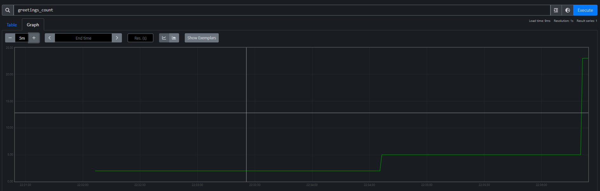
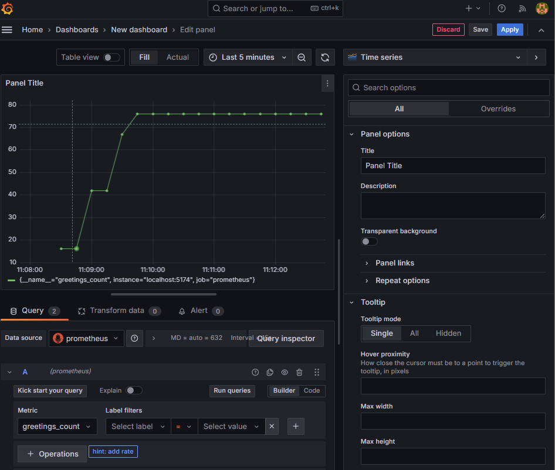
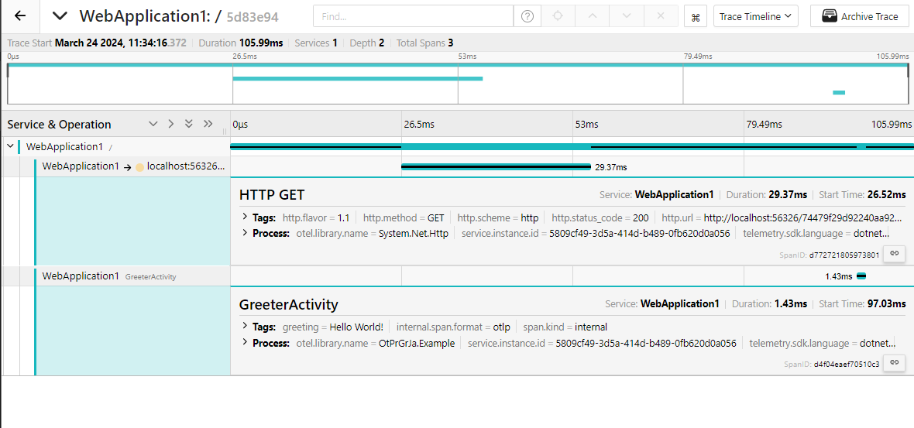

# Coleta de métricas

Nessa atividade, a proposta é coletar métricas de um projeto em execução. Nesse caso utilizei o código do artigo disponibilizado.
Abaixo, seguem imagem da coleta de métricas, e da visualização delas

## Métricas 

```
# TYPE greetings_count counter
# HELP greetings_count Counts the number of greetings
greetings_count 23 1711233550058

# TYPE kestrel_active_connections__connection_ gauge
# UNIT kestrel_active_connections__connection_ _connection_
# HELP kestrel_active_connections__connection_ Number of connections that are currently active on the server.
kestrel_active_connections__connection_{network_transport="tcp",network_type="ipv4",server_address="127.0.0.1",server_port="5174"} 1 1711233550058
kestrel_active_connections__connection_{network_transport="tcp",network_type="ipv6",server_address="::1",server_port="5174"} 1 1711233550058

# TYPE kestrel_connection_duration_s histogram
# UNIT kestrel_connection_duration_s s
# HELP kestrel_connection_duration_s The duration of connections on the server.
kestrel_connection_duration_s_bucket{network_protocol_name="http",network_protocol_version="1.1",network_transport="tcp",network_type="ipv4",server_address="127.0.0.1",server_port="5174",le="0"} 0 1711233550058
kestrel_connection_duration_s_bucket{network_protocol_name="http",network_protocol_version="1.1",network_transport="tcp",network_type="ipv4",server_address="127.0.0.1",server_port="5174",le="5"} 1 1711233550058
kestrel_connection_duration_s_bucket{network_protocol_name="http",network_protocol_version="1.1",network_transport="tcp",network_type="ipv4",server_address="127.0.0.1",server_port="5174",le="10"} 1 1711233550058
kestrel_connection_duration_s_bucket{network_protocol_name="http",network_protocol_version="1.1",network_transport="tcp",network_type="ipv4",server_address="127.0.0.1",server_port="5174",le="25"} 1 1711233550058
kestrel_connection_duration_s_bucket{network_protocol_name="http",network_protocol_version="1.1",network_transport="tcp",network_type="ipv4",server_address="127.0.0.1",server_port="5174",le="50"} 1 1711233550058
kestrel_connection_duration_s_bucket{network_protocol_name="http",network_protocol_version="1.1",network_transport="tcp",network_type="ipv4",server_address="127.0.0.1",server_port="5174",le="75"} 1 1711233550058
kestrel_connection_duration_s_bucket{network_protocol_name="http",network_protocol_version="1.1",network_transport="tcp",network_type="ipv4",server_address="127.0.0.1",server_port="5174",le="100"} 1 1711233550058
kestrel_connection_duration_s_bucket{network_protocol_name="http",network_protocol_version="1.1",network_transport="tcp",network_type="ipv4",server_address="127.0.0.1",server_port="5174",le="250"} 1 1711233550058
kestrel_connection_duration_s_bucket{network_protocol_name="http",network_protocol_version="1.1",network_transport="tcp",network_type="ipv4",server_address="127.0.0.1",server_port="5174",le="500"} 1 1711233550058
kestrel_connection_duration_s_bucket{network_protocol_name="http",network_protocol_version="1.1",network_transport="tcp",network_type="ipv4",server_address="127.0.0.1",server_port="5174",le="750"} 1 1711233550058
kestrel_connection_duration_s_bucket{network_protocol_name="http",network_protocol_version="1.1",network_transport="tcp",network_type="ipv4",server_address="127.0.0.1",server_port="5174",le="1000"} 1 1711233550058
kestrel_connection_duration_s_bucket{network_protocol_name="http",network_protocol_version="1.1",network_transport="tcp",network_type="ipv4",server_address="127.0.0.1",server_port="5174",le="2500"} 1 1711233550058
kestrel_connection_duration_s_bucket{network_protocol_name="http",network_protocol_version="1.1",network_transport="tcp",network_type="ipv4",server_address="127.0.0.1",server_port="5174",le="5000"} 1 1711233550058
kestrel_connection_duration_s_bucket{network_protocol_name="http",network_protocol_version="1.1",network_transport="tcp",network_type="ipv4",server_address="127.0.0.1",server_port="5174",le="7500"} 1 1711233550058
kestrel_connection_duration_s_bucket{network_protocol_name="http",network_protocol_version="1.1",network_transport="tcp",network_type="ipv4",server_address="127.0.0.1",server_port="5174",le="10000"} 1 1711233550058
kestrel_connection_duration_s_bucket{network_protocol_name="http",network_protocol_version="1.1",network_transport="tcp",network_type="ipv4",server_address="127.0.0.1",server_port="5174",le="+Inf"} 1 1711233550058
kestrel_connection_duration_s_sum{network_protocol_name="http",network_protocol_version="1.1",network_transport="tcp",network_type="ipv4",server_address="127.0.0.1",server_port="5174"} 0.0038939 1711233550058
kestrel_connection_duration_s_count{network_protocol_name="http",network_protocol_version="1.1",network_transport="tcp",network_type="ipv4",server_address="127.0.0.1",server_port="5174"} 1 1711233550058
kestrel_connection_duration_s_bucket{network_protocol_name="http",network_protocol_version="1.1",network_transport="tcp",network_type="ipv6",server_address="::1",server_port="5174",le="0"} 0 1711233550058
kestrel_connection_duration_s_bucket{network_protocol_name="http",network_protocol_version="1.1",network_transport="tcp",network_type="ipv6",server_address="::1",server_port="5174",le="5"} 0 1711233550058
kestrel_connection_duration_s_bucket{network_protocol_name="http",network_protocol_version="1.1",network_transport="tcp",network_type="ipv6",server_address="::1",server_port="5174",le="10"} 0 1711233550058
kestrel_connection_duration_s_bucket{network_protocol_name="http",network_protocol_version="1.1",network_transport="tcp",network_type="ipv6",server_address="::1",server_port="5174",le="25"} 0 1711233550058
kestrel_connection_duration_s_bucket{network_protocol_name="http",network_protocol_version="1.1",network_transport="tcp",network_type="ipv6",server_address="::1",server_port="5174",le="50"} 0 1711233550058
kestrel_connection_duration_s_bucket{network_protocol_name="http",network_protocol_version="1.1",network_transport="tcp",network_type="ipv6",server_address="::1",server_port="5174",le="75"} 0 1711233550058
kestrel_connection_duration_s_bucket{network_protocol_name="http",network_protocol_version="1.1",network_transport="tcp",network_type="ipv6",server_address="::1",server_port="5174",le="100"} 1 1711233550058
kestrel_connection_duration_s_bucket{network_protocol_name="http",network_protocol_version="1.1",network_transport="tcp",network_type="ipv6",server_address="::1",server_port="5174",le="250"} 1 1711233550058
kestrel_connection_duration_s_bucket{network_protocol_name="http",network_protocol_version="1.1",network_transport="tcp",network_type="ipv6",server_address="::1",server_port="5174",le="500"} 2 1711233550058
kestrel_connection_duration_s_bucket{network_protocol_name="http",network_protocol_version="1.1",network_transport="tcp",network_type="ipv6",server_address="::1",server_port="5174",le="750"} 2 1711233550058
kestrel_connection_duration_s_bucket{network_protocol_name="http",network_protocol_version="1.1",network_transport="tcp",network_type="ipv6",server_address="::1",server_port="5174",le="1000"} 2 1711233550058
kestrel_connection_duration_s_bucket{network_protocol_name="http",network_protocol_version="1.1",network_transport="tcp",network_type="ipv6",server_address="::1",server_port="5174",le="2500"} 2 1711233550058
kestrel_connection_duration_s_bucket{network_protocol_name="http",network_protocol_version="1.1",network_transport="tcp",network_type="ipv6",server_address="::1",server_port="5174",le="5000"} 2 1711233550058
kestrel_connection_duration_s_bucket{network_protocol_name="http",network_protocol_version="1.1",network_transport="tcp",network_type="ipv6",server_address="::1",server_port="5174",le="7500"} 2 1711233550058
kestrel_connection_duration_s_bucket{network_protocol_name="http",network_protocol_version="1.1",network_transport="tcp",network_type="ipv6",server_address="::1",server_port="5174",le="10000"} 2 1711233550058
kestrel_connection_duration_s_bucket{network_protocol_name="http",network_protocol_version="1.1",network_transport="tcp",network_type="ipv6",server_address="::1",server_port="5174",le="+Inf"} 2 1711233550058
kestrel_connection_duration_s_sum{network_protocol_name="http",network_protocol_version="1.1",network_transport="tcp",network_type="ipv6",server_address="::1",server_port="5174"} 411.421351 1711233550058
kestrel_connection_duration_s_count{network_protocol_name="http",network_protocol_version="1.1",network_transport="tcp",network_type="ipv6",server_address="::1",server_port="5174"} 2 1711233550058

# TYPE kestrel_queued_connections__connection_ gauge
# UNIT kestrel_queued_connections__connection_ _connection_
# HELP kestrel_queued_connections__connection_ Number of connections that are currently queued and are waiting to start.
kestrel_queued_connections__connection_{network_transport="tcp",network_type="ipv4",server_address="127.0.0.1",server_port="5174"} 0 1711233550058
kestrel_queued_connections__connection_{network_transport="tcp",network_type="ipv6",server_address="::1",server_port="5174"} 0 1711233550058

# TYPE http_server_duration_ms histogram
# UNIT http_server_duration_ms ms
# HELP http_server_duration_ms Measures the duration of inbound HTTP requests.
http_server_duration_ms_bucket{http_flavor="1.1",http_method="GET",http_route="/",http_scheme="http",http_status_code="200",net_host_name="localhost",net_host_port="5174",le="0"} 0 1711233550058
http_server_duration_ms_bucket{http_flavor="1.1",http_method="GET",http_route="/",http_scheme="http",http_status_code="200",net_host_name="localhost",net_host_port="5174",le="5"} 0 1711233550058
http_server_duration_ms_bucket{http_flavor="1.1",http_method="GET",http_route="/",http_scheme="http",http_status_code="200",net_host_name="localhost",net_host_port="5174",le="10"} 19 1711233550058
http_server_duration_ms_bucket{http_flavor="1.1",http_method="GET",http_route="/",http_scheme="http",http_status_code="200",net_host_name="localhost",net_host_port="5174",le="25"} 21 1711233550058
http_server_duration_ms_bucket{http_flavor="1.1",http_method="GET",http_route="/",http_scheme="http",http_status_code="200",net_host_name="localhost",net_host_port="5174",le="50"} 22 1711233550058
http_server_duration_ms_bucket{http_flavor="1.1",http_method="GET",http_route="/",http_scheme="http",http_status_code="200",net_host_name="localhost",net_host_port="5174",le="75"} 22 1711233550058
http_server_duration_ms_bucket{http_flavor="1.1",http_method="GET",http_route="/",http_scheme="http",http_status_code="200",net_host_name="localhost",net_host_port="5174",le="100"} 22 1711233550058
http_server_duration_ms_bucket{http_flavor="1.1",http_method="GET",http_route="/",http_scheme="http",http_status_code="200",net_host_name="localhost",net_host_port="5174",le="250"} 23 1711233550058
http_server_duration_ms_bucket{http_flavor="1.1",http_method="GET",http_route="/",http_scheme="http",http_status_code="200",net_host_name="localhost",net_host_port="5174",le="500"} 23 1711233550058
http_server_duration_ms_bucket{http_flavor="1.1",http_method="GET",http_route="/",http_scheme="http",http_status_code="200",net_host_name="localhost",net_host_port="5174",le="750"} 23 1711233550058
http_server_duration_ms_bucket{http_flavor="1.1",http_method="GET",http_route="/",http_scheme="http",http_status_code="200",net_host_name="localhost",net_host_port="5174",le="1000"} 23 1711233550058
http_server_duration_ms_bucket{http_flavor="1.1",http_method="GET",http_route="/",http_scheme="http",http_status_code="200",net_host_name="localhost",net_host_port="5174",le="2500"} 23 1711233550058
http_server_duration_ms_bucket{http_flavor="1.1",http_method="GET",http_route="/",http_scheme="http",http_status_code="200",net_host_name="localhost",net_host_port="5174",le="5000"} 23 1711233550058
http_server_duration_ms_bucket{http_flavor="1.1",http_method="GET",http_route="/",http_scheme="http",http_status_code="200",net_host_name="localhost",net_host_port="5174",le="7500"} 23 1711233550058
http_server_duration_ms_bucket{http_flavor="1.1",http_method="GET",http_route="/",http_scheme="http",http_status_code="200",net_host_name="localhost",net_host_port="5174",le="10000"} 23 1711233550058
http_server_duration_ms_bucket{http_flavor="1.1",http_method="GET",http_route="/",http_scheme="http",http_status_code="200",net_host_name="localhost",net_host_port="5174",le="+Inf"} 23 1711233550058
http_server_duration_ms_sum{http_flavor="1.1",http_method="GET",http_route="/",http_scheme="http",http_status_code="200",net_host_name="localhost",net_host_port="5174"} 318.5147999999999 1711233550058
http_server_duration_ms_count{http_flavor="1.1",http_method="GET",http_route="/",http_scheme="http",http_status_code="200",net_host_name="localhost",net_host_port="5174"} 23 1711233550058
http_server_duration_ms_bucket{http_flavor="1.1",http_method="GET",http_scheme="http",http_status_code="404",net_host_name="localhost",net_host_port="5174",le="0"} 0 1711233550058
http_server_duration_ms_bucket{http_flavor="1.1",http_method="GET",http_scheme="http",http_status_code="404",net_host_name="localhost",net_host_port="5174",le="5"} 0 1711233550058
http_server_duration_ms_bucket{http_flavor="1.1",http_method="GET",http_scheme="http",http_status_code="404",net_host_name="localhost",net_host_port="5174",le="10"} 1 1711233550058
http_server_duration_ms_bucket{http_flavor="1.1",http_method="GET",http_scheme="http",http_status_code="404",net_host_name="localhost",net_host_port="5174",le="25"} 1 1711233550058
http_server_duration_ms_bucket{http_flavor="1.1",http_method="GET",http_scheme="http",http_status_code="404",net_host_name="localhost",net_host_port="5174",le="50"} 1 1711233550058
http_server_duration_ms_bucket{http_flavor="1.1",http_method="GET",http_scheme="http",http_status_code="404",net_host_name="localhost",net_host_port="5174",le="75"} 1 1711233550058
http_server_duration_ms_bucket{http_flavor="1.1",http_method="GET",http_scheme="http",http_status_code="404",net_host_name="localhost",net_host_port="5174",le="100"} 1 1711233550058
http_server_duration_ms_bucket{http_flavor="1.1",http_method="GET",http_scheme="http",http_status_code="404",net_host_name="localhost",net_host_port="5174",le="250"} 1 1711233550058
http_server_duration_ms_bucket{http_flavor="1.1",http_method="GET",http_scheme="http",http_status_code="404",net_host_name="localhost",net_host_port="5174",le="500"} 1 1711233550058
http_server_duration_ms_bucket{http_flavor="1.1",http_method="GET",http_scheme="http",http_status_code="404",net_host_name="localhost",net_host_port="5174",le="750"} 1 1711233550058
http_server_duration_ms_bucket{http_flavor="1.1",http_method="GET",http_scheme="http",http_status_code="404",net_host_name="localhost",net_host_port="5174",le="1000"} 1 1711233550058
http_server_duration_ms_bucket{http_flavor="1.1",http_method="GET",http_scheme="http",http_status_code="404",net_host_name="localhost",net_host_port="5174",le="2500"} 1 1711233550058
http_server_duration_ms_bucket{http_flavor="1.1",http_method="GET",http_scheme="http",http_status_code="404",net_host_name="localhost",net_host_port="5174",le="5000"} 1 1711233550058
http_server_duration_ms_bucket{http_flavor="1.1",http_method="GET",http_scheme="http",http_status_code="404",net_host_name="localhost",net_host_port="5174",le="7500"} 1 1711233550058
http_server_duration_ms_bucket{http_flavor="1.1",http_method="GET",http_scheme="http",http_status_code="404",net_host_name="localhost",net_host_port="5174",le="10000"} 1 1711233550058
http_server_duration_ms_bucket{http_flavor="1.1",http_method="GET",http_scheme="http",http_status_code="404",net_host_name="localhost",net_host_port="5174",le="+Inf"} 1 1711233550058
http_server_duration_ms_sum{http_flavor="1.1",http_method="GET",http_scheme="http",http_status_code="404",net_host_name="localhost",net_host_port="5174"} 7.5839 1711233550058
http_server_duration_ms_count{http_flavor="1.1",http_method="GET",http_scheme="http",http_status_code="404",net_host_name="localhost",net_host_port="5174"} 1 1711233550058

# TYPE http_server_active_requests__request_ gauge
# UNIT http_server_active_requests__request_ _request_
# HELP http_server_active_requests__request_ Number of active HTTP server requests.
http_server_active_requests__request_{http_request_method="GET",url_scheme="http"} 1 1711233550058

# TYPE http_server_request_duration_s histogram
# UNIT http_server_request_duration_s s
# HELP http_server_request_duration_s Duration of HTTP server requests.
http_server_request_duration_s_bucket{http_request_method="GET",http_response_status_code="200",http_route="/",network_protocol_version="1.1",url_scheme="http",le="0"} 0 1711233550058
http_server_request_duration_s_bucket{http_request_method="GET",http_response_status_code="200",http_route="/",network_protocol_version="1.1",url_scheme="http",le="5"} 23 1711233550058
http_server_request_duration_s_bucket{http_request_method="GET",http_response_status_code="200",http_route="/",network_protocol_version="1.1",url_scheme="http",le="10"} 23 1711233550058
http_server_request_duration_s_bucket{http_request_method="GET",http_response_status_code="200",http_route="/",network_protocol_version="1.1",url_scheme="http",le="25"} 23 1711233550058
http_server_request_duration_s_bucket{http_request_method="GET",http_response_status_code="200",http_route="/",network_protocol_version="1.1",url_scheme="http",le="50"} 23 1711233550058
http_server_request_duration_s_bucket{http_request_method="GET",http_response_status_code="200",http_route="/",network_protocol_version="1.1",url_scheme="http",le="75"} 23 1711233550058
http_server_request_duration_s_bucket{http_request_method="GET",http_response_status_code="200",http_route="/",network_protocol_version="1.1",url_scheme="http",le="100"} 23 1711233550058
http_server_request_duration_s_bucket{http_request_method="GET",http_response_status_code="200",http_route="/",network_protocol_version="1.1",url_scheme="http",le="250"} 23 1711233550058
http_server_request_duration_s_bucket{http_request_method="GET",http_response_status_code="200",http_route="/",network_protocol_version="1.1",url_scheme="http",le="500"} 23 1711233550058
http_server_request_duration_s_bucket{http_request_method="GET",http_response_status_code="200",http_route="/",network_protocol_version="1.1",url_scheme="http",le="750"} 23 1711233550058
http_server_request_duration_s_bucket{http_request_method="GET",http_response_status_code="200",http_route="/",network_protocol_version="1.1",url_scheme="http",le="1000"} 23 1711233550058
http_server_request_duration_s_bucket{http_request_method="GET",http_response_status_code="200",http_route="/",network_protocol_version="1.1",url_scheme="http",le="2500"} 23 1711233550058
http_server_request_duration_s_bucket{http_request_method="GET",http_response_status_code="200",http_route="/",network_protocol_version="1.1",url_scheme="http",le="5000"} 23 1711233550058
http_server_request_duration_s_bucket{http_request_method="GET",http_response_status_code="200",http_route="/",network_protocol_version="1.1",url_scheme="http",le="7500"} 23 1711233550058
http_server_request_duration_s_bucket{http_request_method="GET",http_response_status_code="200",http_route="/",network_protocol_version="1.1",url_scheme="http",le="10000"} 23 1711233550058
http_server_request_duration_s_bucket{http_request_method="GET",http_response_status_code="200",http_route="/",network_protocol_version="1.1",url_scheme="http",le="+Inf"} 23 1711233550058
http_server_request_duration_s_sum{http_request_method="GET",http_response_status_code="200",http_route="/",network_protocol_version="1.1",url_scheme="http"} 0.3320876 1711233550058
http_server_request_duration_s_count{http_request_method="GET",http_response_status_code="200",http_route="/",network_protocol_version="1.1",url_scheme="http"} 23 1711233550058
http_server_request_duration_s_bucket{http_request_method="GET",http_response_status_code="200",http_route="/metrics",network_protocol_version="1.1",url_scheme="http",le="0"} 0 1711233550058
http_server_request_duration_s_bucket{http_request_method="GET",http_response_status_code="200",http_route="/metrics",network_protocol_version="1.1",url_scheme="http",le="5"} 26 1711233550058
http_server_request_duration_s_bucket{http_request_method="GET",http_response_status_code="200",http_route="/metrics",network_protocol_version="1.1",url_scheme="http",le="10"} 26 1711233550058
http_server_request_duration_s_bucket{http_request_method="GET",http_response_status_code="200",http_route="/metrics",network_protocol_version="1.1",url_scheme="http",le="25"} 26 1711233550058
http_server_request_duration_s_bucket{http_request_method="GET",http_response_status_code="200",http_route="/metrics",network_protocol_version="1.1",url_scheme="http",le="50"} 26 1711233550058
http_server_request_duration_s_bucket{http_request_method="GET",http_response_status_code="200",http_route="/metrics",network_protocol_version="1.1",url_scheme="http",le="75"} 26 1711233550058
http_server_request_duration_s_bucket{http_request_method="GET",http_response_status_code="200",http_route="/metrics",network_protocol_version="1.1",url_scheme="http",le="100"} 26 1711233550058
http_server_request_duration_s_bucket{http_request_method="GET",http_response_status_code="200",http_route="/metrics",network_protocol_version="1.1",url_scheme="http",le="250"} 26 1711233550058
http_server_request_duration_s_bucket{http_request_method="GET",http_response_status_code="200",http_route="/metrics",network_protocol_version="1.1",url_scheme="http",le="500"} 26 1711233550058
http_server_request_duration_s_bucket{http_request_method="GET",http_response_status_code="200",http_route="/metrics",network_protocol_version="1.1",url_scheme="http",le="750"} 26 1711233550058
http_server_request_duration_s_bucket{http_request_method="GET",http_response_status_code="200",http_route="/metrics",network_protocol_version="1.1",url_scheme="http",le="1000"} 26 1711233550058
http_server_request_duration_s_bucket{http_request_method="GET",http_response_status_code="200",http_route="/metrics",network_protocol_version="1.1",url_scheme="http",le="2500"} 26 1711233550058
http_server_request_duration_s_bucket{http_request_method="GET",http_response_status_code="200",http_route="/metrics",network_protocol_version="1.1",url_scheme="http",le="5000"} 26 1711233550058
http_server_request_duration_s_bucket{http_request_method="GET",http_response_status_code="200",http_route="/metrics",network_protocol_version="1.1",url_scheme="http",le="7500"} 26 1711233550058
http_server_request_duration_s_bucket{http_request_method="GET",http_response_status_code="200",http_route="/metrics",network_protocol_version="1.1",url_scheme="http",le="10000"} 26 1711233550058
http_server_request_duration_s_bucket{http_request_method="GET",http_response_status_code="200",http_route="/metrics",network_protocol_version="1.1",url_scheme="http",le="+Inf"} 26 1711233550058
http_server_request_duration_s_sum{http_request_method="GET",http_response_status_code="200",http_route="/metrics",network_protocol_version="1.1",url_scheme="http"} 0.022008 1711233550058
http_server_request_duration_s_count{http_request_method="GET",http_response_status_code="200",http_route="/metrics",network_protocol_version="1.1",url_scheme="http"} 26 1711233550058
http_server_request_duration_s_bucket{aspnetcore_request_is_unhandled="True",http_request_method="GET",http_response_status_code="404",network_protocol_version="1.1",url_scheme="http",le="0"} 0 1711233550058
http_server_request_duration_s_bucket{aspnetcore_request_is_unhandled="True",http_request_method="GET",http_response_status_code="404",network_protocol_version="1.1",url_scheme="http",le="5"} 1 1711233550058
http_server_request_duration_s_bucket{aspnetcore_request_is_unhandled="True",http_request_method="GET",http_response_status_code="404",network_protocol_version="1.1",url_scheme="http",le="10"} 1 1711233550058
http_server_request_duration_s_bucket{aspnetcore_request_is_unhandled="True",http_request_method="GET",http_response_status_code="404",network_protocol_version="1.1",url_scheme="http",le="25"} 1 1711233550058
http_server_request_duration_s_bucket{aspnetcore_request_is_unhandled="True",http_request_method="GET",http_response_status_code="404",network_protocol_version="1.1",url_scheme="http",le="50"} 1 1711233550058
http_server_request_duration_s_bucket{aspnetcore_request_is_unhandled="True",http_request_method="GET",http_response_status_code="404",network_protocol_version="1.1",url_scheme="http",le="75"} 1 1711233550058
http_server_request_duration_s_bucket{aspnetcore_request_is_unhandled="True",http_request_method="GET",http_response_status_code="404",network_protocol_version="1.1",url_scheme="http",le="100"} 1 1711233550058
http_server_request_duration_s_bucket{aspnetcore_request_is_unhandled="True",http_request_method="GET",http_response_status_code="404",network_protocol_version="1.1",url_scheme="http",le="250"} 1 1711233550058
http_server_request_duration_s_bucket{aspnetcore_request_is_unhandled="True",http_request_method="GET",http_response_status_code="404",network_protocol_version="1.1",url_scheme="http",le="500"} 1 1711233550058
http_server_request_duration_s_bucket{aspnetcore_request_is_unhandled="True",http_request_method="GET",http_response_status_code="404",network_protocol_version="1.1",url_scheme="http",le="750"} 1 1711233550058
http_server_request_duration_s_bucket{aspnetcore_request_is_unhandled="True",http_request_method="GET",http_response_status_code="404",network_protocol_version="1.1",url_scheme="http",le="1000"} 1 1711233550058
http_server_request_duration_s_bucket{aspnetcore_request_is_unhandled="True",http_request_method="GET",http_response_status_code="404",network_protocol_version="1.1",url_scheme="http",le="2500"} 1 1711233550058
http_server_request_duration_s_bucket{aspnetcore_request_is_unhandled="True",http_request_method="GET",http_response_status_code="404",network_protocol_version="1.1",url_scheme="http",le="5000"} 1 1711233550058
http_server_request_duration_s_bucket{aspnetcore_request_is_unhandled="True",http_request_method="GET",http_response_status_code="404",network_protocol_version="1.1",url_scheme="http",le="7500"} 1 1711233550058
http_server_request_duration_s_bucket{aspnetcore_request_is_unhandled="True",http_request_method="GET",http_response_status_code="404",network_protocol_version="1.1",url_scheme="http",le="10000"} 1 1711233550058
http_server_request_duration_s_bucket{aspnetcore_request_is_unhandled="True",http_request_method="GET",http_response_status_code="404",network_protocol_version="1.1",url_scheme="http",le="+Inf"} 1 1711233550058
http_server_request_duration_s_sum{aspnetcore_request_is_unhandled="True",http_request_method="GET",http_response_status_code="404",network_protocol_version="1.1",url_scheme="http"} 0.0072975 1711233550058
http_server_request_duration_s_count{aspnetcore_request_is_unhandled="True",http_request_method="GET",http_response_status_code="404",network_protocol_version="1.1",url_scheme="http"} 1 1711233550058

# EOF

```


## Visualização

### Prometheus



Essa é a visualização do Prometheus, onde é possível ver as métricas coletadas. A métrica selecionada foi 'greeetings_count', que é um contador de quantas vezes a rota foi acessada.

### Grafana



Essa é a visualização do Grafana, onde é possível ver as métricas coletadas do prometheus. Com o grafana, é possível visualizar diversas métricas diferentes, e colocá-las em um dashboard, o que facilita a visualização e análise das métricas.

## Jaeger



Essa é a visualização do Jaeger, onde é possível ver as traces das requisições feitas. Com o Jaeger, é possível ver o tempo de execução de cada requisição, e ver se há algum gargalo no sistema.

## Conclusão

Com essa atividade, podemos perceber importância de coletar métricas de uma aplicação, e como isso pode ser útil para monitorar o sistema. Com as métricas, é possível identificar gargalos, e problemas no sistema, e assim, melhorar a performance da aplicação. As ferramentas utilizadas são extremamente úteis para o propósito de aprendizagem dessa atividade.  